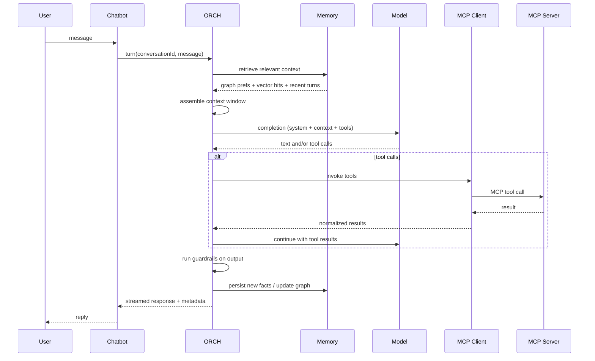

# Chatbot Platform Architecture

A platform chatbot that can be deployed across multiple surfaces, orchestrate tool calls through MCP, and maintain durable memory with built-in safety and observability.

---

## Overview

The chatbot is the user-facing layer. It handles conversation, session state, and channel-specific rendering. Behind it, an **orchestrator** plans and executes turns, a **MCP client** invokes tools, and **MCP servers** expose domain capabilities (APIs, databases, workflows, etc.).

```
┌─────────────────────────────────────────────────────────────────┐
│                        Integration Surfaces                      │
│  Chat App  │  Embedded (script/iframe)  │  Teams/Slack/etc.     │
└────────────────────────────┬────────────────────────────────────┘
                             │
                             ▼
┌─────────────────────────────────────────────────────────────────┐
│                          Chatbot                                 │
│  Session · UI/UX · Channel adapters · Auth handoff              │
└────────────────────────────┬────────────────────────────────────┘
                             │
                             ▼
┌─────────────────────────────────────────────────────────────────┐
│                     Orchestrator (ORCH)                          │
│  Turn loop · Guardrails · Context assembler · Memory I/O        │
└────────────────────────────┬────────────────────────────────────┘
                             │
                             ▼
┌─────────────────────────────────────────────────────────────────┐
│                       MCP Client                                 │
│  Tool discovery · Invocation · Result normalization             │
└────────────────────────────┬────────────────────────────────────┘
                             │
                             ▼
┌─────────────────────────────────────────────────────────────────┐
│                       MCP Server(s)                              │
│  Domain tools · Resources · Prompts                               │
└─────────────────────────────────────────────────────────────────┘
```

---

## Integration Surfaces

The same core chatbot can be consumed through different deployment models. Each surface uses a thin **channel adapter** that translates between the channel protocol and the chatbot's internal API.

### 1. Chat App

A standalone conversational application (similar to ChatGPT).

| Concern | Approach |
|---------|----------|
| **Auth** | User accounts, SSO, or API keys depending on deployment |
| **Session** | Server-managed conversation threads with history |
| **Streaming** | SSE or WebSocket for token and tool-event streaming |
| **UI** | Full control over layout, markdown, code blocks, tool call cards |

The chat app talks directly to the chatbot backend. It owns the richest UX: sidebar history, file uploads, settings, and memory management UI.

### 2. Embedded in External Apps

Embed the chatbot into third-party public or protected applications via **script tag** or **iframe**.

| Mode | Use case | Notes |
|------|----------|-------|
| **Script widget** | Drop-in chat bubble on any web page | Loads SDK, mounts UI, passes config (tenant, user token, theme) |
| **Iframe** | Sandboxed embed with strict CSP | Parent passes context via `postMessage`; good for untrusted hosts |
| **Protected app** | Internal dashboards, admin panels | Host app provides auth token; chatbot scopes tools to that user's permissions |

**Embedding contract:**

- Host provides: `tenantId`, `userId` (or anonymous session), optional `context` (page metadata, entity IDs).
- Widget provides: chat UI, streaming responses, optional branding overrides.
- Auth: short-lived tokens issued by the platform, validated on every request.

### 3. Messaging Platforms

Channel adapters for Teams, Slack, WhatsApp, Telegram, and similar platforms.

| Platform | Adapter responsibility |
|----------|------------------------|
| **Slack** | Bolt app, slash commands, thread replies, block kit rendering |
| **Microsoft Teams** | Bot Framework, adaptive cards, proactive messages |
| **WhatsApp** | Business API webhooks, template messages, media handling |
| **Telegram** | Bot API, inline keyboards, group vs DM routing |

Each adapter normalizes inbound messages into a common `InboundMessage` shape and maps outbound responses back to the platform's format (text, cards, buttons, attachments).

```
Platform webhook/event
        │
        ▼
  Channel Adapter  ──►  Chatbot API  ──►  ORCH  ──►  ...
        │
        ▼
  Platform reply (text/card/action)
```

---

## Core Architecture

### Layer Responsibilities

| Layer | Role |
|-------|------|
| **Chatbot** | User/session boundary. Receives messages, streams replies, manages conversation threads. Delegates reasoning to ORCH. |
| **ORCH (Orchestrator)** | Turn execution engine. Runs the loop: assemble context → call model → evaluate guardrails → invoke tools → persist memory → return response. |
| **MCP Client** | Protocol client for MCP. Discovers tools/resources from configured servers, executes tool calls, handles errors and timeouts. |
| **MCP Server** | Exposes domain capabilities as MCP tools. Stateless or stateful depending on domain. Multiple servers can be registered per tenant. |

### Turn Lifecycle



---

## Features

### Memory Architecture

Memory is split by **retrieval strategy**, not by storage backend alone. Two complementary stores serve different recall patterns.

#### Graph Memory — Preferences & Relationships

Used for structured, relational knowledge:

- User preferences (language, tone, notification settings)
- Entity relationships (user ↔ project ↔ team)
- Explicit facts the user asked to remember
- Policy and permission edges (what this user can access)

**Properties:** typed nodes and edges, traversable queries ("what projects does this user care about?"), deterministic updates, easy to audit and delete.

```
(User)──prefers──▶(Language: en)
(User)──member_of──▶(Team: Platform)
(User)──interested_in──▶(Topic: billing)
```

#### Vector Memory — Semantic Recall

Used for unstructured or fuzzy retrieval:

- Past conversation snippets
- Document chunks and knowledge base content
- Tool output summaries worth recalling later
- Embeddings of long-form context

**Properties:** similarity search, handles paraphrase, good for "have we discussed this before?" style recall.

#### Memory Write Policy

Not every turn writes to memory. ORCH applies a **memory extraction step** after each turn:

1. Classify candidates: preference, fact, episodic, discard.
2. Preferences and explicit facts → graph upsert.
3. Episodic / semantic content → vector index with metadata (conversationId, timestamp, source).
4. Respect user commands: "forget X", "remember Y" override automatic extraction.

#### Retrieval at Turn Time

The **context assembler** pulls from both stores (see below) within a token budget, ranked by relevance and recency.

---

### Guardrails

Guardrails run at defined checkpoints in the turn loop. They are policy engines, not afterthoughts.

| Checkpoint | What is checked |
|------------|-----------------|
| **Input** | Prompt injection, PII in user message, blocked topics, rate limits |
| **Pre-tool** | Tool allowlist per tenant/user, argument validation, destructive-action confirmation |
| **Output** | Hallucination markers, leaked secrets, policy violations, tone/brand rules |
| **Post-turn** | Memory write approval (sensitive facts require explicit consent) |

Guardrails can **block**, **warn** (log + proceed), or **rewrite** (sanitize output before delivery). All decisions are emitted as observability events.

Configuration is per-tenant: rule sets, blocklists, allowed tool scopes, and custom classifiers (keyword, regex, LLM-judge).

---

### Context Assembler

The context assembler builds the prompt sent to the model on each turn. It operates under a fixed **token budget** and assembles from prioritized sources.

**Source priority (typical):**

1. System instructions and tenant config
2. Guardrail-injected constraints
3. Graph memory — active preferences and permissions
4. Vector memory — top-k relevant chunks
5. Recent conversation turns (sliding window)
6. Tool definitions (from MCP Client discovery)
7. Channel-specific context (page metadata, thread ID, platform user profile)

**Strategies:**

- **Truncation:** oldest turns dropped first; vector chunks ranked by score then trimmed.
- **Summarization:** compress distant history into a rolling summary stored in vector memory.
- **Deduplication:** merge overlapping vector hits and graph facts before injection.
- **Tool pruning:** expose only tools relevant to the current intent (reduces noise and misuse).

The assembler outputs a structured `ContextBundle` consumed by ORCH and logged for debugging.

---

### Observability

Every layer emits structured telemetry. The goal is to answer: *what happened, why, and how long did it take?*

| Signal | Examples |
|--------|----------|
| **Traces** | End-to-end turn span: chatbot → ORCH → model → MCP → memory |
| **Metrics** | Latency p50/p99, token usage, tool call success rate, guardrail block rate |
| **Logs** | Structured JSON per event; correlation via `traceId`, `conversationId`, `tenantId` |
| **Events** | `turn.started`, `context.assembled`, `tool.invoked`, `guardrail.triggered`, `memory.written` |

**Dashboards:**

- Per-tenant usage and cost
- Tool reliability and error breakdown
- Guardrail hit rates by rule
- Memory growth and retrieval quality

**Debugging:** replay a turn from stored `ContextBundle` + model request/response without re-executing tools.

---

## MCP Integration

### MCP Client

- Registers one or more MCP servers per tenant/environment.
- On startup (or on demand): `list_tools`, `list_resources`, cache schemas.
- Executes `call_tool` with timeout, retry policy, and circuit breaker per server.
- Normalizes errors into ORCH-actionable results (retry, fail turn, ask user).

### MCP Server

- Exposes domain logic as typed tools with JSON Schema inputs.
- Can expose resources (read-only context) and prompts (reusable templates).
- Runs independently; versioned and deployed per domain team.
- Authorization enforced at the server boundary (MCP client passes auth context).

### Multi-Server Topology

```
ORCH
 └── MCP Client
      ├── MCP Server: CRM
      ├── MCP Server: Billing
      ├── MCP Server: Internal Wiki
      └── MCP Server: Custom (tenant-specific)
```

Tool discovery results are merged; the context assembler can filter by relevance and permission scope.

---

## Security Model

| Layer | Control |
|-------|---------|
| **Chatbot / Embed** | Token-based auth, origin allowlist for widgets, CSP for iframes |
| **ORCH** | Tenant isolation, per-user tool scopes, guardrails |
| **MCP Client** | Credential forwarding, no tool execution without ORCH approval |
| **MCP Server** | Domain-level authZ, input validation, audit log |

Secrets never flow into model context. Tool credentials are held by MCP Client/Server, not embedded in prompts.

---

## Future: Multi-Agent

The current architecture is a single orchestrator loop. Multi-agent support will extend ORCH without changing the chatbot or MCP boundaries.

**Planned model:**

```
ORCH (supervisor)
 ├── Agent: Research   → MCP tools (search, docs)
 ├── Agent: Actions    → MCP tools (CRM, tickets)
 └── Agent: Review     → guardrails + output validation
```

| Concept | Description |
|---------|-------------|
| **Supervisor** | Decomposes user intent, delegates to specialist agents, merges results |
| **Specialist agents** | Scoped system prompts, tool subsets, and memory namespaces |
| **Handoff protocol** | Structured messages between agents (not raw chat history) |
| **Shared memory** | Graph for cross-agent facts; per-agent vector namespaces optional |
| **Observability** | Per-agent spans nested under the turn trace |

The chatbot and MCP Client interfaces remain unchanged. Multi-agent is an internal ORCH execution strategy.

---

## Deployment View

```
                    ┌──────────────┐
                    │  CDN / Edge  │  ← embed script, static chat app
                    └──────┬───────┘
                           │
              ┌────────────┴────────────┐
              ▼                         ▼
     ┌─────────────────┐      ┌─────────────────┐
     │  Chatbot API    │      │ Channel Webhooks │
     │  (REST + WS)    │      │ Slack/Teams/...  │
     └────────┬────────┘      └────────┬─────────┘
              │                        │
              └────────────┬───────────┘
                           ▼
                  ┌─────────────────┐
                  │  Orchestrator   │
                  └────────┬────────┘
                           │
         ┌─────────────────┼─────────────────┐
         ▼                 ▼                 ▼
  ┌─────────────┐  ┌─────────────┐  ┌─────────────┐
  │ Graph DB    │  │ Vector DB   │  │ Model API   │
  └─────────────┘  └─────────────┘  └─────────────┘
                           │
                           ▼
                  ┌─────────────────┐
                  │  MCP Client     │ ──► MCP Server(s)
                  └─────────────────┘
```

---

## Glossary

| Term | Definition |
|------|------------|
| **Turn** | One user message through to the assistant's complete reply |
| **ORCH** | Orchestrator — executes the turn loop |
| **Context Bundle** | Assembled prompt components ready for the model |
| **Channel Adapter** | Translates a messaging platform ↔ chatbot API |
| **MCP** | Model Context Protocol — standard for tool/resource exposure to LLMs |
