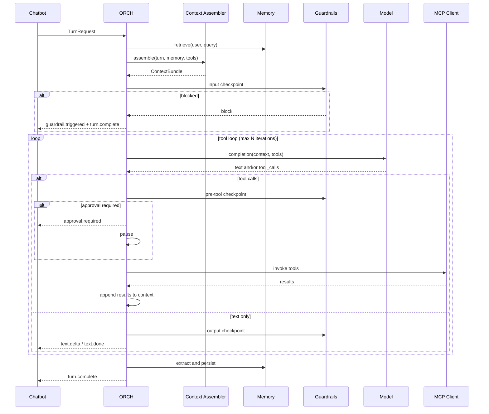

# ORCH Turn Engine

**Status:** Draft  
**Priority:** P1  
**Closes gaps:** Architecture gaps §5 (Model layer — execution), §8 (HITL), §9 (Turn execution edge cases)

---

## Purpose

Define the **orchestrator turn execution engine**: the state machine, tool loop, cancellation, concurrency, timeouts, partial failure handling, and human-in-the-loop (HITL) pause/resume. ORCH is the brain between Chatbot and downstream services (model, MCP, memory, guardrails).

**Related docs:**

- [`01-api-and-streaming-events.md`](01-api-and-streaming-events.md) — `TurnRequest`, SSE events
- [`02-data-model-and-persistence.md`](02-data-model-and-persistence.md) — `Turn`, `Message`, `ToolCall`
- [`06-model-provider.md`](06-model-provider.md) — model calls within the loop
- [`07-context-assembler.md`](07-context-assembler.md) — context built before each model call
- [`08-memory.md`](08-memory.md) — retrieve at start, extract at end
- [`10-mcp-integration.md`](10-mcp-integration.md) — tool invocation
- [`14-guardrails.md`](14-guardrails.md) — checkpoint execution

---

## Scope

### In scope

- Turn state machine and main loop
- Tool execution (serial, parallel, retry, dedup)
- Cancellation and timeouts
- Concurrency policy per conversation
- HITL approval flows
- Async / long-running turns (queued work)
- Error handling and partial results

### Out of scope

- Model provider internals — `06-model-provider.md`
- Context assembly algorithm — `07-context-assembler.md`
- Guardrail rule definitions — `14-guardrails.md`
- Multi-agent delegation — `21-multi-agent.md`

---

## Turn State Machine

```
                    ┌──────────┐
                    │ pending  │
                    └────┬─────┘
                         │ start
                         ▼
                    ┌──────────┐
         cancel ──► │ running  │ ◄── resume (from paused)
                    └────┬─────┘
           ┌─────────────┼─────────────┐
           │             │             │
           ▼             ▼             ▼
      ┌─────────┐   ┌─────────┐   ┌─────────┐
      │ paused  │   │completed│   │ failed  │
      └────┬────┘   └─────────┘   └─────────┘
           │ deny/timeout
           ▼
      ┌───────────┐
      │ cancelled │
      └───────────┘
```

| Status | Description |
|--------|-------------|
| `pending` | Accepted, queued (concurrency gate) |
| `running` | Actively executing |
| `paused` | Waiting for HITL approval or external input |
| `completed` | Successfully finished |
| `cancelled` | User or system cancelled |
| `failed` | Unrecoverable error |

---

## Main Turn Loop



### Loop invariants

- Max tool-loop iterations per turn: **10** (tenant-configurable, default 10).
- Max wall-clock time per turn: **120 s** (tenant-configurable).
- Each model call receives an updated `ContextBundle` including prior tool results in the turn.
- ORCH emits SSE events at each step (see `01-api-and-streaming-events.md`).

### Pseudocode

```
function executeTurn(request):
  turn = createTurn(request)
  emit(turn.started)

  memory = memory.retrieve(request.userId, request.userMessage)
  tools = mcp.discover(request.tenantId)
  context = contextAssembler.assemble(request, memory, tools)

  if guardrails.input(context).blocked:
    return completeWithBlock(turn)

  iteration = 0
  while iteration < maxIterations:
  if turn.cancelled: return cancel(turn)
  if elapsed(turn) > turnTimeout: return fail(turn, "turn_timeout")

    response = model.complete(context, tools)

    if response.hasToolCalls():
      for call in response.toolCalls:
        if guardrails.preTool(call).requiresApproval:
          approval = pauseForApproval(turn, call)
          if approval.denied: return cancel(turn)
        results = executeTools(response.toolCalls)  // parallel where safe
        context = context.appendToolResults(results)
      iteration++
      continue

    if response.hasText():
      finalText = guardrails.output(response.text)
      persistAndStreamAssistantMessage(turn, finalText)
      break

  memory.extractAndPersist(turn, context)
  return complete(turn)
```

---

## Tool Execution

### Parallel vs serial

| Condition | Execution |
|-----------|-----------|
| Multiple tool calls, no dependencies | **Parallel** (up to `maxParallelTools`, default 5) |
| Same tool name + identical args in one response | **Deduped** — execute once, fan result to all call IDs |
| Tool marked `sequential: true` in schema metadata | **Serial** |
| Pre-tool guardrail requires ordering | **Serial** |

### Retry policy

Per-tool, from MCP server config (`04-multi-tenancy-and-config.md`):

| Error type | Action |
|------------|--------|
| `retryable: true` (timeout, 503) | Retry up to `maxAttempts` with backoff |
| `retryable: false` (400, auth) | Fail immediately |
| Partial batch failure | Succeeding tools return results; failed tools get error result in context |

### Tool output limits

- Max result size per tool: **100 KB** JSON (configurable).
- Larger results: truncate with `truncated: true` + summary, or spill to attachment store and pass reference.
- ORCH never passes raw secrets from tool output into memory extraction without guardrail scan.

### Idempotent tools within a turn

Canonical key: `hash(serverId + toolName + stableStringify(arguments))`.

Duplicate invocations within the same turn return cached result without re-executing.

---

## Cancellation

### User-initiated

`POST /conversations/{id}/turns/{turnId}/cancel`

1. Set turn `cancelled` flag (atomic).
2. Abort in-flight model stream (provider cancel API).
3. Cancel pending MCP invocations (best-effort; idempotent tools may have already committed).
4. Emit `turn.cancelled`.
5. Persist any partial assistant text already streamed (marked `metadata.partial: true`).

### System-initiated

- Turn timeout exceeded → `failed` with `code: turn_timeout`.
- Tenant suspended mid-turn → cancel with `code: tenant_suspended`.

### Paused turns

Cancellation while `paused` immediately transitions to `cancelled`; pending approval invalidated.

---

## Concurrency

Per-conversation policy from tenant config (`conversation.concurrencyPolicy`):

| Policy | Behavior |
|--------|----------|
| `queue` (default) | Second message waits in `pending` until first turn completes |
| `reject` | Second message returns `409 turn_in_progress` |
| `interrupt` | Cancel running turn, start new one (chat app "send anyway") |

Queue depth per conversation: max **5** pending turns; overflow returns `429 queue_full`.

### Cross-conversation

No limit beyond tenant `maxConcurrentTurns` quota.

---

## Human-in-the-Loop (HITL)

### Triggers

- Pre-tool guardrail marks action as `requires_approval` (e.g. destructive ops, charges).
- Tenant rule: specific tools always require approval.
- Model confidence below threshold (optional, tenant config).

### Flow

```
1. ORCH reaches pre-tool checkpoint → action = requires_approval
2. Create ApprovalRecord (appr_...)
3. Turn status → paused
4. Emit approval.required (SSE + webhook)
5. Wait for:
     POST /turns/{turnId}/approvals/{approvalId}/resolve { action: approve|deny }
   or timeout (default 8 h, configurable)
6. approve → resume tool execution
   deny  → turn.cancelled
   timeout → turn.cancelled (notify user)
```

### ApprovalRecord

```json
{
  "id": "appr_01H...",
  "turnId": "turn_01H...",
  "toolCallId": "tc_01H...",
  "prompt": "Confirm charge of $500?",
  "status": "pending",
  "expiresAt": "...",
  "resolvedAt": null,
  "resolvedBy": null,
  "action": null
}
```

### Channel-specific approval UI

- Chat app: inline confirm/deny buttons.
- Slack/Teams: interactive message with buttons (see `13-channel-adapters.md`).
- Embed: webhook to host + optional native UI via `postMessage`.

### Durable pause

Approval state persisted in DB. ORCH worker can exit while paused; resume picks up from `ApprovalRecord` on resolve.

---

## Async & Long-Running Turns

For work exceeding turn timeout (large reports, batch operations):

1. ORCH starts turn, sends immediate ack: "Working on it…"
2. Heavy work dispatched to **job queue** with `turnId` reference.
3. Turn stays `running`; heartbeat events optional.
4. On completion: proactive message via Chatbot (SSE if connected, else channel push).
5. Turn → `completed`.

Tenant feature flag: `asyncTurns` (default off for v1; enable per tenant).

---

## Escalation to Human Agent

Optional terminal path when bot cannot resolve:

1. ORCH emits `escalation.requested` with transcript summary.
2. Integration with support queue (webhook or MCP tool).
3. Turn → `completed` with `metadata.escalated: true`.

Details in `13-channel-adapters.md` and `19-admin-and-operations.md`.

---

## Error Handling

| Scenario | Behavior |
|----------|----------|
| Model timeout | Retry once with fallback model; then `failed` |
| All tools fail | Model receives error results; may explain failure to user |
| Context too large | Context assembler truncates; if still over limit → `failed` `context_overflow` |
| Guardrail block (output) | Rewrite if configured; else block message and `turn.complete` with notice |
| MCP server down (circuit open) | Skip tools from that server; inform model tools unavailable |
| Worker crash mid-turn | Turn stays `running`; recovery job marks `failed` after 5 min or resumes from last checkpoint |

---

## Internal Interfaces

### ORCH input

`TurnRequest` — defined in `01-api-and-streaming-events.md`.

### ORCH output

Stream of turn events to Chatbot message bus. Chatbot persists and forwards to client.

### Checkpoint storage

For replay and recovery, ORCH stores per-iteration:

```json
{
  "turnId": "turn_01H...",
  "iteration": 2,
  "contextBundleRef": "bundle_01H...",
  "modelRequestRef": "mreq_01H...",
  "modelResponseRef": "mres_01H...",
  "toolResults": []
}
```

Retention: 7 days (aligned with observability replay in `16-observability-and-slos.md`).

---

## Configuration

| Key | Default | Description |
|-----|---------|-------------|
| `maxToolIterations` | 10 | Max model↔tool loops per turn |
| `turnTimeoutMs` | 120000 | Wall-clock turn limit |
| `maxParallelTools` | 5 | Concurrent MCP invocations |
| `maxToolResultBytes` | 102400 | Per-tool result cap |
| `approvalTimeoutMs` | 28800000 | 8 h HITL wait |
| `concurrencyPolicy` | `queue` | Per conversation |

All tenant-overridable via `04-multi-tenancy-and-config.md`.

---

## Open Questions

1. Merge vs queue for rapid-fire messages — product decision per channel; default `queue`.
2. Turn-level model override from API metadata — allow for `admin` role only?
3. Speculative tool execution (run before model confirms) — not in v1.
